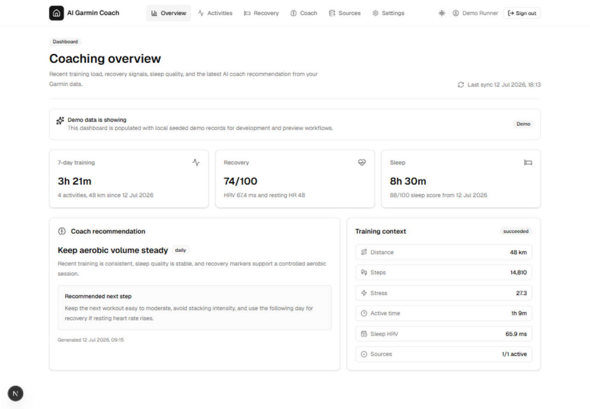
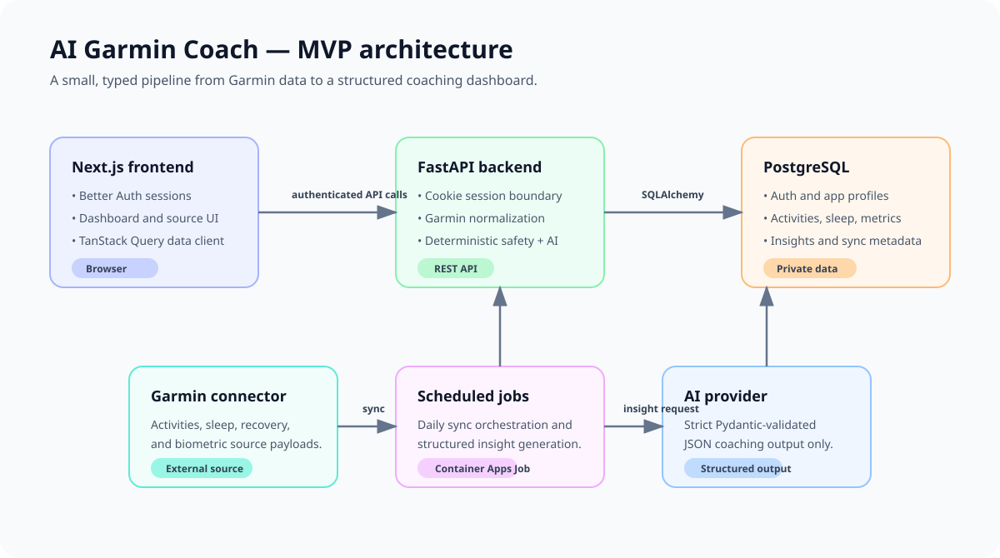

# AI Garmin Coach

AI Garmin Coach is a full-stack fitness dashboard that turns Garmin activity,
sleep, and recovery records into a concise daily coaching view. It focuses on
reliable ingestion, user-owned data, and conservative structured guidance—not
an open-ended chat experience.



## Highlights

- Normalizes Garmin activity, sleep, recovery, and biometric data into
  connector-neutral records.
- Presents activity, recovery, sleep, source, and coach views in a Next.js
  dashboard.
- Generates schema-validated daily coach insights from deterministic metric
  summaries and safety rules.
- Provides deterministic synthetic demo data, so the complete product flow can
  be explored without Garmin credentials or real health data.

## Architecture

Next.js owns interactive authentication through Better Auth. FastAPI validates
the shared session before accessing user-scoped data in PostgreSQL. Scheduled
jobs orchestrate sync and insight generation outside web requests.



For the production topology and operational constraints, see
[deployment.md](docs/deployment.md).

## AI Coaching

The coach turns 7-day activity, sleep, and recovery summaries into a typed JSON
insight. Deterministic safety rules flag sparse data, poor recovery, elevated
resting heart rate, low HRV, rising load, and optional pain/injury language
before provider output is validated and readiness is capped. Guidance is
conservative and non-medical.

The implementation lives in
[metric_summary.py](backend/app/services/metric_summary.py),
[coach_safety.py](backend/app/services/coach_safety.py), and
[coach.py](backend/app/services/coach.py). The local default is deterministic
mock output; OpenAI structured output is optional.

## Run Locally

Prerequisites: Python 3.12 with `uv`, Node.js with npm, and local PostgreSQL.
Copy `.env.example` to `.env` and set local-only values there.

```bash
cd backend
uv sync --dev
uv run alembic upgrade head
uv run uvicorn app.main:app --reload
```

```bash
cd frontend
npm install
npm run auth:migrate
npm run dev
```

The frontend runs at `http://localhost:3000` and the API at
`http://localhost:8000`.

### Demo data

Seed a complete synthetic dashboard without Garmin credentials:

```bash
cd frontend
npm run demo:seed
```

Sign in with `demo@example.test` and `demo-password-local-only`. The seed is
safe to rerun and refuses production environments. See the
[demo script](docs/demo-script.md) for a short guided walkthrough.

## Quality Checks

```bash
cd backend
uv run ruff check
uv run mypy app
uv run pytest
```

```bash
cd frontend
npm run lint
npm run format:check
npm run typecheck
npm run test
```

Pull-request CI also audits locked dependencies and builds the frontend and
backend container images.

## Security And Data Handling

Better Auth protects browser sessions; FastAPI scopes all app data to the
authenticated user. Garmin session material is encrypted at rest, credentials
are not retained after connection setup, logs redact sensitive fields, and the
app provides disconnect and data-deletion controls.

Read the [security notes](docs/security.md) for the complete data inventory,
cookie and CSRF posture, rate limits, lifecycle behavior, and Garmin-specific
considerations.

## Deployment

Infrastructure is defined in Bicep under `infra/`. The intended Azure MVP uses
separate frontend and API Container Apps, private PostgreSQL, Key Vault, Azure
Container Registry, and ingress-free migration, sync, and demo-seed jobs.

Deployment details, smoke tests, and cost guardrails are in
[deployment.md](docs/deployment.md) and [infra/README.md](infra/README.md).

## Limitations

- `python-garminconnect` is not a formal Garmin OAuth integration; provider
  login behavior and available fields can change.
- Garmin data can be delayed or incomplete, and coach guidance is not medical
  advice or diagnosis.
- The MVP excludes chat, team sharing, real-time sync, queues, Redis, and a
  broad connector catalogue.
- The initial Azure topology is deliberately single-replica and scale-to-zero;
  shared or edge rate limiting is needed before horizontally scaled public use.

## Further Reading

| Topic                        | Details                                            |
| ---------------------------- | -------------------------------------------------- |
| Architecture and constraints | [docs/architecture.md](docs/architecture.md)         |
| Security and privacy         | [docs/security.md](docs/security.md)               |
| Background jobs              | [docs/background-jobs.md](docs/background-jobs.md) |
| Deployment and operations    | [docs/deployment.md](docs/deployment.md)           |
| Demo walkthrough             | [docs/demo-script.md](docs/demo-script.md)         |

## Status

MVP in development. The active roadmap is in `.ai/PLANS.md`.
